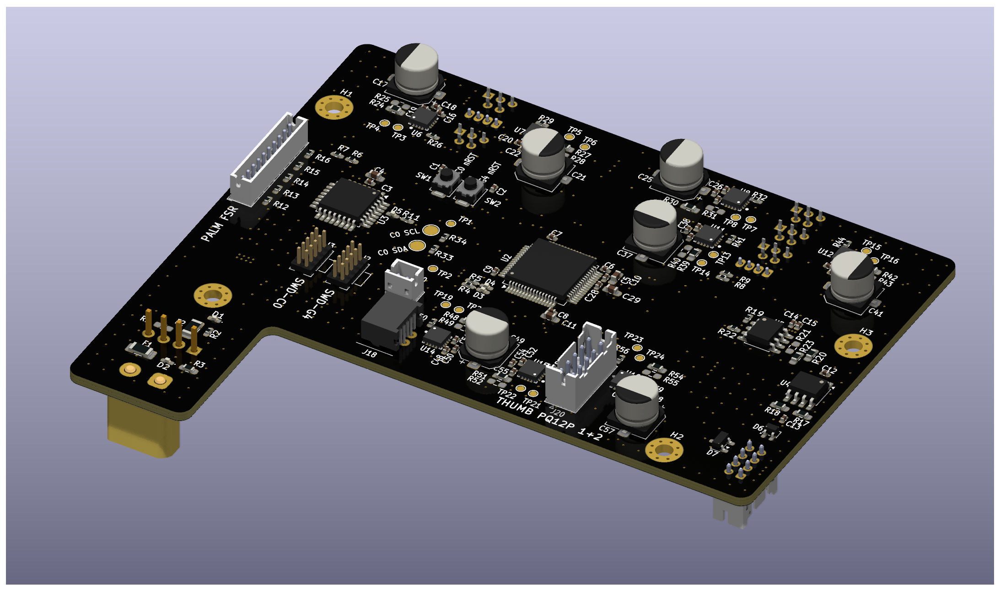
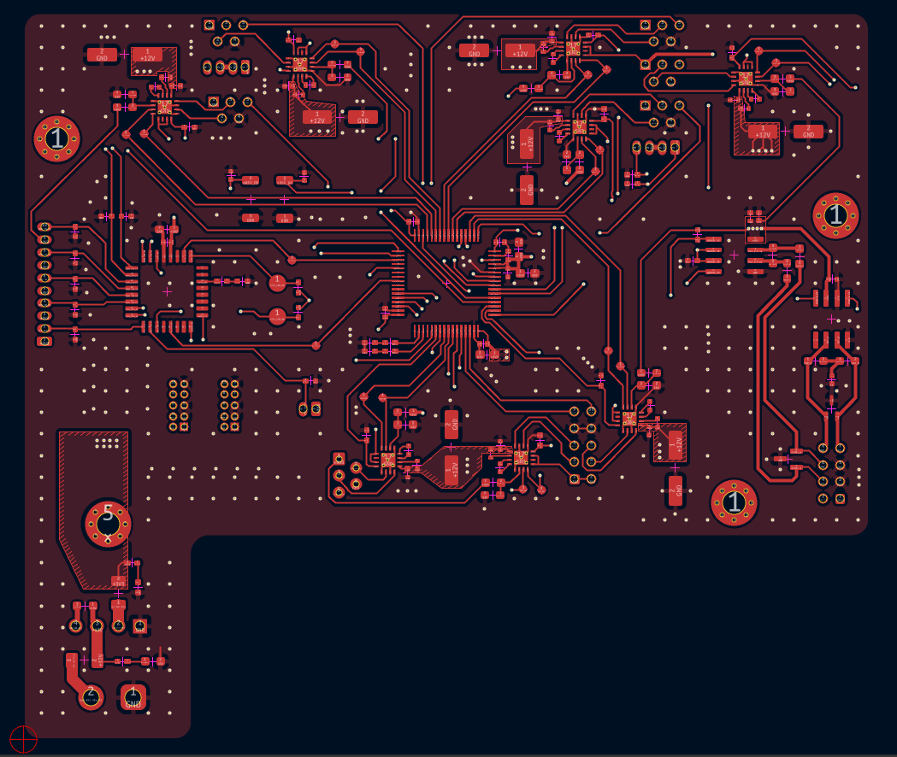
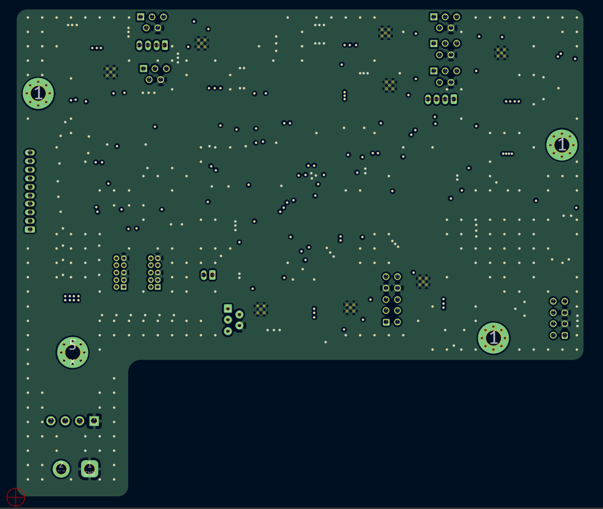
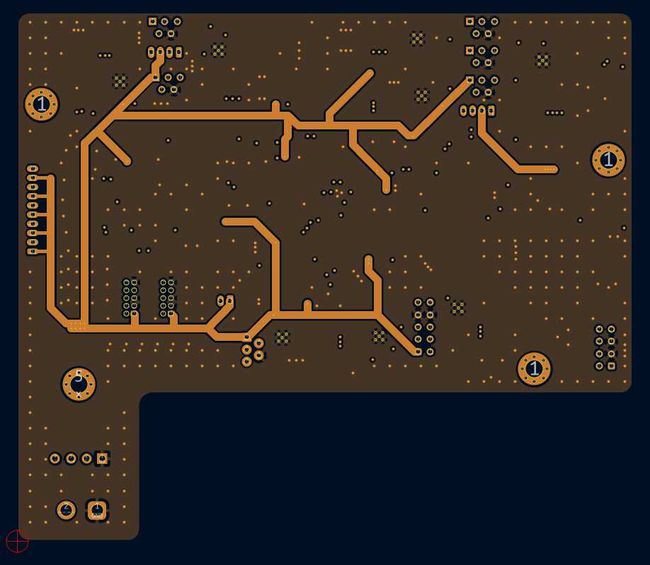
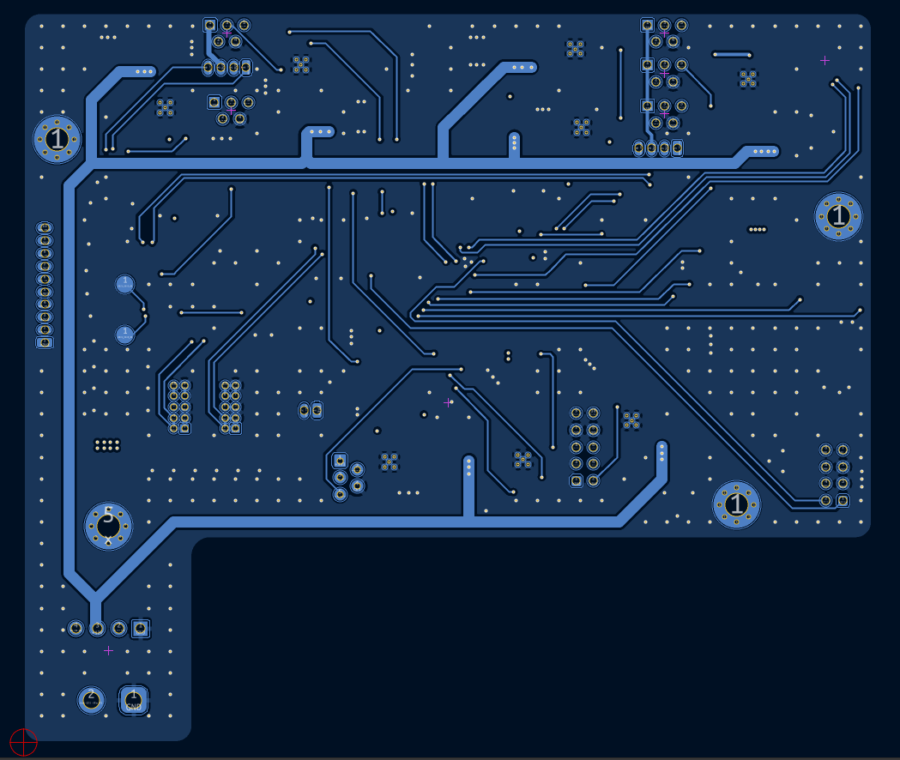

# Electrical

The electrical system for bananaHand is built around the main board. The main board is responsible for communication with the controlling device, motor control, and FSR sensing. A simplified block diagram descibing the main board can be seen below. It requires a single +12V 24W input source and exposes UART, CAN bus, and UART over RS485 options for interfacing. Depending on the device you are trying to interface with, a buck converter may be needed to drop your source voltage down to the required 12V.

## Main Board

The main board has the following sub-circuits:

- **Micro-controllers**: There are two MCUs on the main board. The first is the stm32g474, responsible for communication with the upstream device and motor control. The second micro-controller is the stm32c071, which acts as a "smart" ADC, filtering and forwarding force readings to the stm32g4.
- **Power stage**: Basic fuse protection, and a MPM3610 buck converter for 12V -> 3V3 for logic level ICs
- **Motor driving**: There are eight DRV8876 motor driver circuits for the [PQ12P](https://www.actuonix.com/pq12-30-12-p). The driving circuits are controlled and motor positions are read by the stm32g474 micro-controller.
- **Force sensing**: Simple linear voltage divider circuits are used to interface with the force sensitive resistors. Their voltages are read by the 2nd micro-controller on board the stm32c071
- **Communication interfaces**: There are three communication interfaces exposed by the board: CAN Bus, UART, and half-duplex RS485.

### Schematic

A full PDF of the schematic can be found in `bh_main_board/bananaHand_main_board_sch.pdf` or linked [here](./bh_main_board/bananaHand_main_board_sch.pdf).

### Layout

**Four layer:** Sig, GND, GND/PWR, Sig

